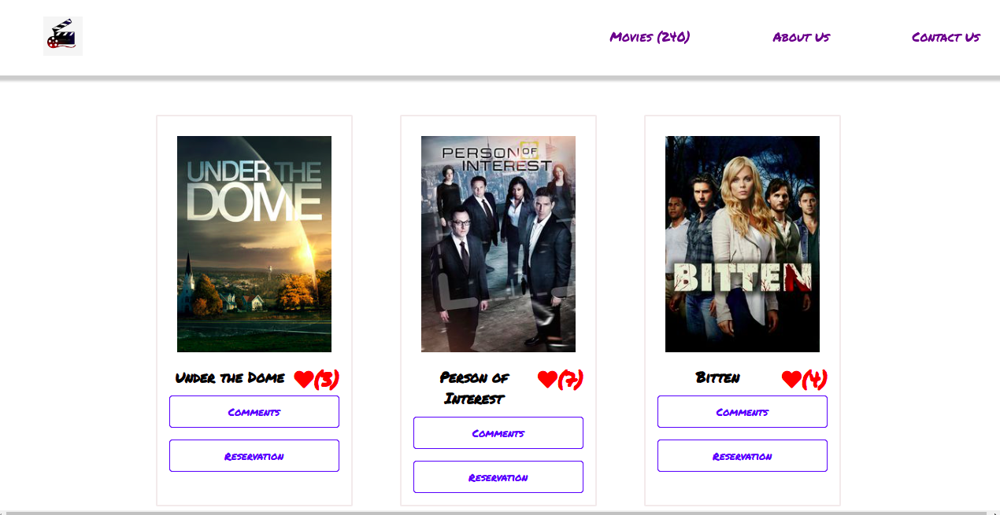
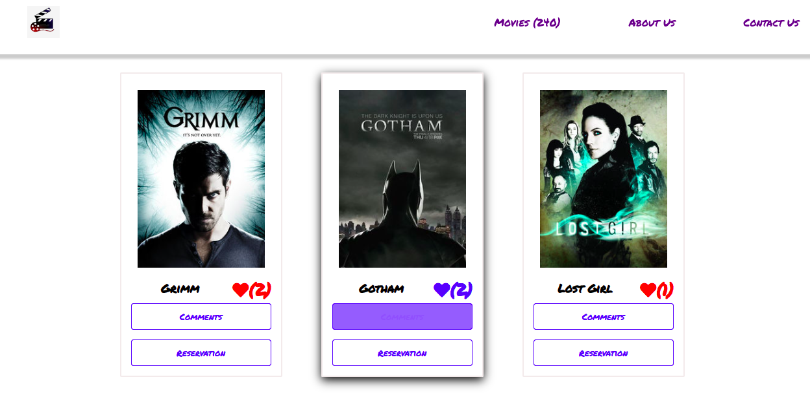
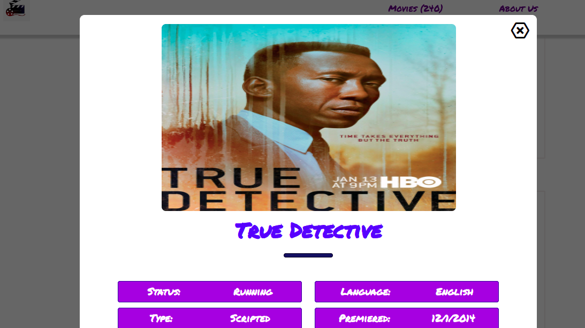
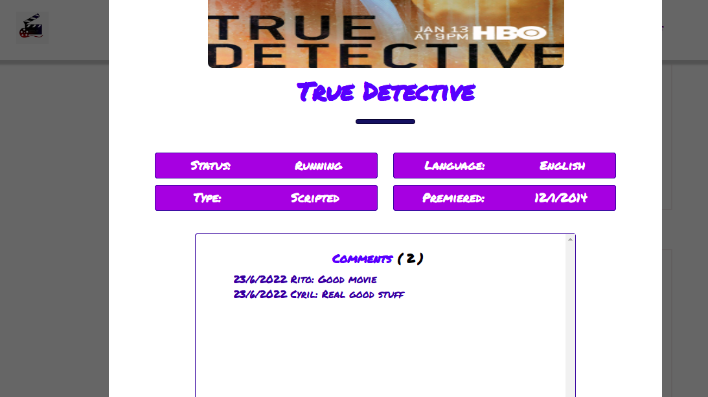

# Movie App

> It's a webapp for tv shows with interactive buttons. It opens pop up to view details of each movie and get user comments. It has likes button which records likes to correct movie in the backend API. This project also have unit testing. Whole project is in ES6 modular structure and `JavaScript OOP` paradigm. The project follow `DRY`, `KISS`, `YAGNI` principles by heart.


## Built With

- JavaScript
- HTML5
- CSS3
- Jest
- API

## Live Demo

[Live Demo Link](https://cyrilmuchemi.github.io/Movie-App-Project)

## Project Description Video

[Video Link](https://drive.google.com/file/d/1lfr5iWsBbrjY_UmQufnlOCVDJxL6QfEP/view?usp=sharing)

## Getting Started

- NodeJs, npm needs to be installed in system
- For local project set up, run ``` git clone https://github.com/cyrilmuchemi/Movie-App-Project.git ```

## Install Linters

- Run ``` npm install ```

## Buid Project

- Run ``` npm run build ```

## Serve Project

- Run ``` npm run serve ```

## Extra configuration for testing

- Run ``` npm test```


## Authors

👤 **Ritobroto Mukherjee**

- Portfolio: [@Rito](https://ritobrotomukherjee.github.io/Work-Portfolio/)
- GitHub: [@RitobrotoMukherjee](https://github.com/RitobrotoMukherjee)
- Twitter: [@RitobrotoM3](https://twitter.com/RitobrotoM3)
- LinkedIn: [Ritobroto Mukherjee](https://www.linkedin.com/in/ritobroto-mukherjee-519148ba/)

👤 **Author2**

- GitHub: [@cyrilmuchemi](https://github.com/cyrilmuchemi)
- Twitter: [@cyrilmuchemi](https://twitter.com/cyrilmuchemi)
- LinkedIn: [Cyril Muchemi](https://linkedin.com/in/cyrilmuchemi)

## Screenshots

- **Home Screen**



- **Home Screen**



- **Popup**



- **Popup**




## 🤝 Contributing

Contributions, issues, and feature requests are welcome!

Feel free to check the [issues page](../../issues/).

## Show your support

Give a ⭐️ if you like this project!

## Acknowledgments

- Microverse

## 📝 License

This project is [MIT](./MIT.md) licensed.

## Code Reviewer
- Teddy-Livingstone Ememandu[@gitHub](https://github.com/TedLivist)